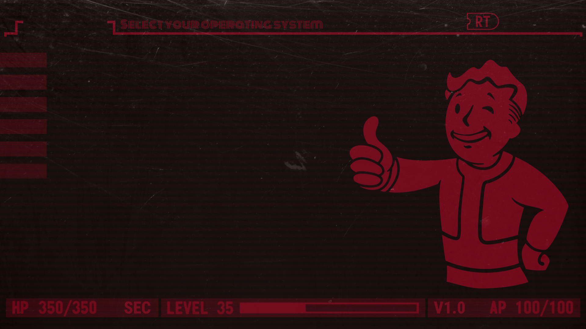

# Vello GRUB Theme

<div align="center">



*A modern, elegant GRUB bootloader theme with clean aesthetics and customizable design*

[](LICENSE)
[](https://www.gnu.org/software/grub/)

</div>

## Overview

Vello GRUB is a beautiful and modern theme for the GRUB2 bootloader, designed to make your boot experience visually appealing. This theme features a sleek interface with custom fonts, icons for major Linux distributions, and a carefully crafted color scheme.

### Inspiration

This theme is based on two excellent projects:
- [Dracula GRUB](https://github.com/dracula/grub) - For the dark theme inspiration
- [GRUB Themes by svlv](https://github.com/svlv/grub-themes) - For the structure and icon set

## Features

- **High Resolution Support**: Optimized for Full HD (1920x1080) displays
- **Custom Typography**: Includes DotGothic16 and Roboto Condensed fonts
- **Distribution Icons**: Pre-configured icons for 30+ Linux distributions
- **Customizable Backgrounds**: Multiple background options included
- **Clean Interface**: Minimalist design with excellent readability
- **Unicode Support**: Full unicode font support for international characters

## Preview

The theme includes:
- Custom background with elegant design
- Clear boot menu with distribution-specific icons
- Visible boot timeout counter
- High contrast selected item highlighting

## Installation

1. **Clone or download this repository**:
   ```bash
   git clone https://github.com/Colgate13/vello-grub
   cd vello-grub
   ```

2. **Copy the theme to GRUB themes directory**:
   ```bash
   sudo cp -r vello-grub /boot/grub/themes/
   ```

3. **Edit your GRUB configuration**:
   ```bash
   sudo nano /etc/default/grub
   ```

4. **Add or modify the following lines**:
   ```bash
   GRUB_THEME="/boot/grub/themes/vello-grub/theme.txt"
   GRUB_GFXMODE=1920x1080
   ```

5. **Update GRUB**:

   For Debian/Ubuntu-based systems:
   ```bash
   sudo update-grub
   ```

   For Arch/Manjaro-based systems:
   ```bash
   sudo grub-mkconfig -o /boot/grub/grub.cfg
   ```

   For Fedora/RHEL-based systems:
   ```bash
   sudo grub2-mkconfig -o /boot/grub2/grub.cfg
   ```

6. **Reboot to see the theme**:
   ```bash
   sudo reboot
   ```

## License

This project is open source and available under the MIT License.

## Credits

- Based on [Dracula GRUB](https://github.com/dracula/grub)
- Inspired by [GRUB Themes](https://github.com/svlv/grub-themes)
- Fonts: DotGothic16, Roboto Condensed
- Created with love for the Linux community
